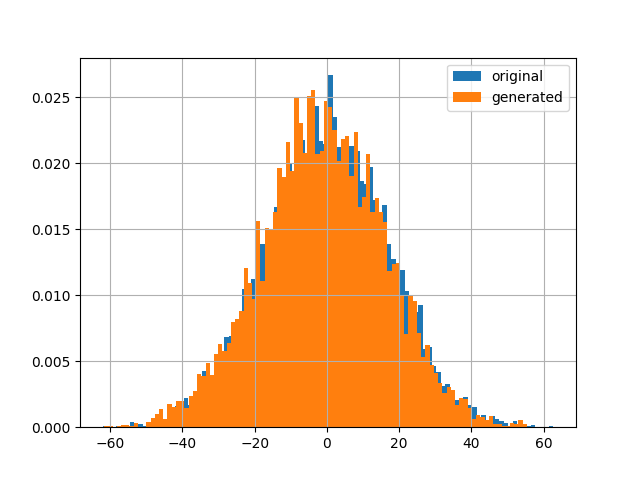
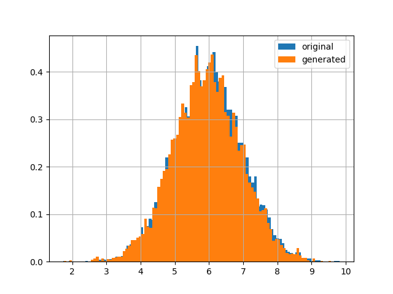

# norta-python
Python implementation of Norta procedure (Cario and Nelson, 1997.)


## Installation

1. Clone the repository:

```
git clone https://github.com/CuarteroAlvaro/norta-python.git
```

2. Jump into the repository:
```
cd norta-python
```

3. Install the package using pip:
```
pip install .
```

or in develop model:

```
python3 setup.py develop --user
```

## Usage
```python

from norta.norta import Norta 

import matplotlib.pyplot as plt
import numpy as np
import pandas as pd

if __name__ == "__main__":
    data = np.zeros((10000, 2))
    data[:, 0] = np.random.normal(size = data.shape[0], loc = 0, scale = 17)
    data[:, 1] = np.random.normal(size = data.shape[0], loc = 6, scale = 1)

    norta = Norta(data)
    samples = norta.generate_samples(n_samples=10000, n_bins = 150)

    for i in range(data.shape[1]):
        df = pd.DataFrame({'original':  data[:, i], 'generated': samples[:, i]})

        df['original'].hist(bins = 100, density = 1, legend = "original")
        df['generated'].hist(bins = 100, density = 1, legend = "generated")

        plt.show()
        plt.close()

```

wich outputs:

```bash
100%|███████████████████████████████████████████████████████████████████████████████████████████████████████████████████████████████████████████████████████████████████████████████████████████████████████████████████████████████████████| 2/2 [00:00<00:00, 3509.88it/s]
100%|██████████████████████████████████████████████████████████████████████████████████████████████████████████████████████████████████████████████████████████████████████████████████████████████████████████████████████████████| 10000/10000 [00:00<00:00, 49731.08it/s]
```

and plots:



