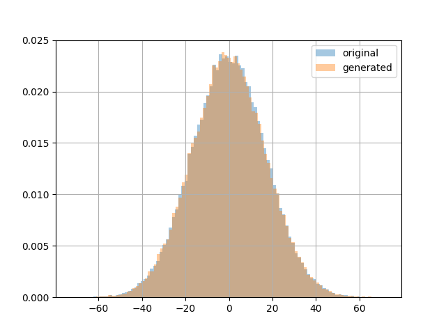
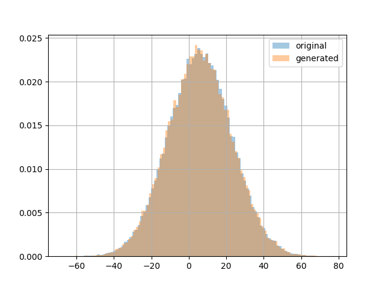

# norta-python
Python implementation of Norta procedure (Cario and Nelson, 1997.)


## Installation

This module is uploaded to `PyPi` so it can be installed using `pip`:

```bash
pip install norta-python
```

Also, it can be installed using this repository:
```
git clone https://github.com/CuarteroAlvaro/norta-python.git
```
```
cd norta-python
```
```
python setup.py develop --user
```


## Usage
```python
from norta import Norta 

import matplotlib.pyplot as plt
import numpy as np
import pandas as pd

if __name__ == "__main__":
    data = np.zeros((100000, 2))
    data[:, 0] = np.random.normal(size = data.shape[0], loc = 0, scale = 17)
    data[:, 1] = data[:, 0] + np.random.normal(size = data.shape[0], loc = 6, scale = 1)

    norta = Norta(data)
    samples = norta.generate_samples(n_samples=100000, n_bins = 150)

    for i in range(data.shape[1]):
        df = pd.DataFrame({'original':  data[:, i], 'generated': samples[:, i]})

        df['original'].hist(bins = 100, density = 1, legend = "original", alpha = 0.4)
        df['generated'].hist(bins = 100, density = 1, legend = "generated", alpha = 0.4)

        plt.show()
        plt.close()


```

wich outputs:

```bash
Computing cfds: 100%|██████████████████████████████████████████████████████████| 2/2 [00:00<00:00, 999.12it/s]
Generating samples: 100%|██████████████████████████████████████████| 100000/100000 [00:02<00:00, 48154.00it/s]
```

and plots:




